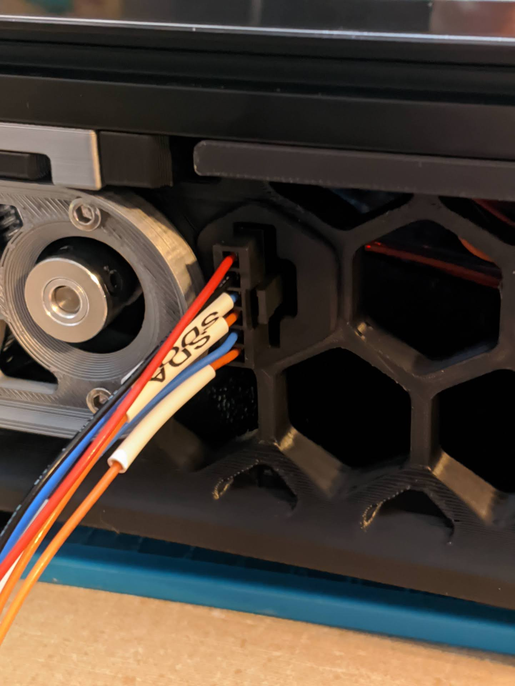
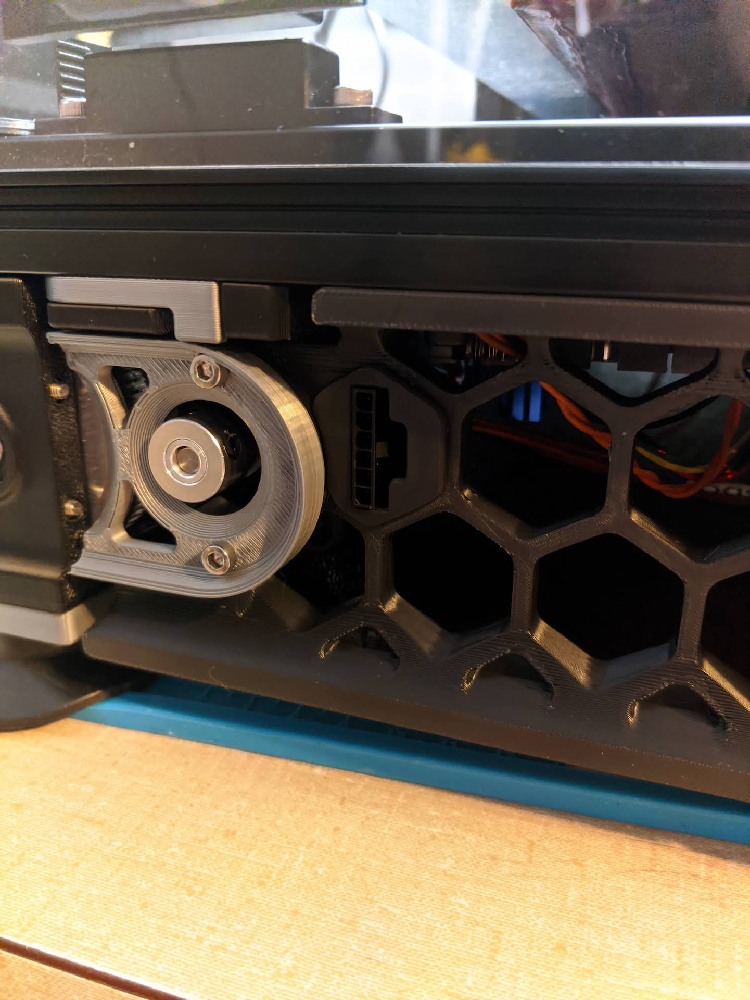
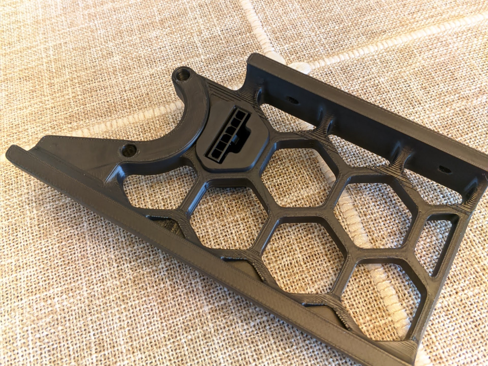
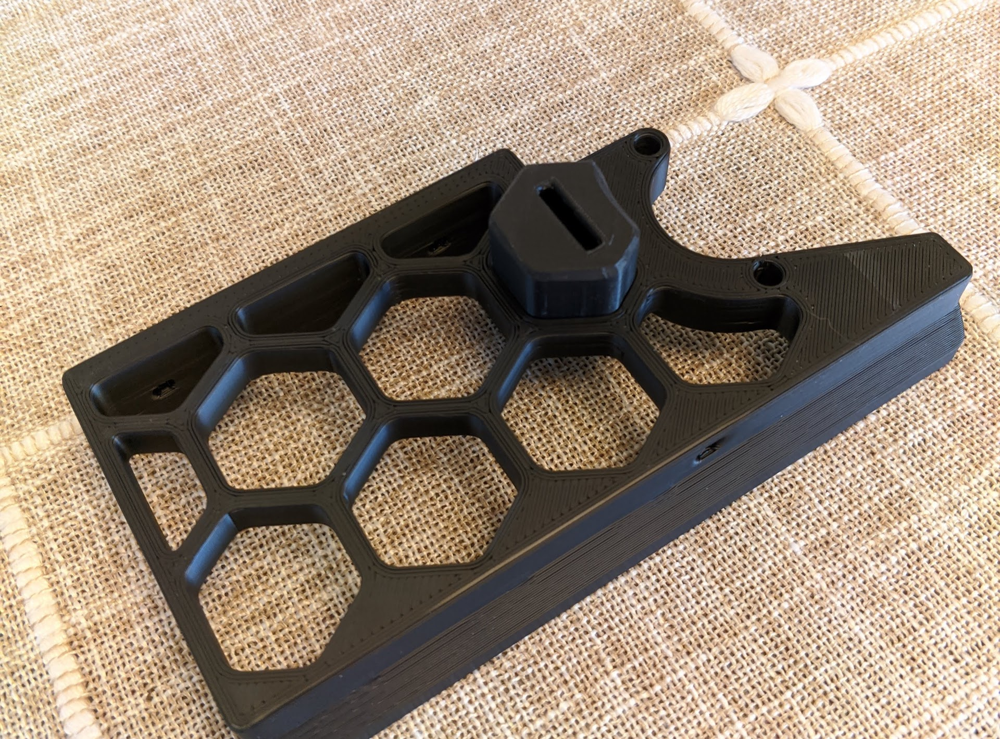

# Skirt Microfit Housing

Allows a 6-pin Microfit connector to be permanently installed in the front or rear skirt. It was designed using the 300 A skirt, but if you mirror it in the slicer, it should work for a B skirt as well.

The images are from a previous iteration. The current STL has a cutout so it doesn't bind with the Z motor and holds the housing slightly tighter.

